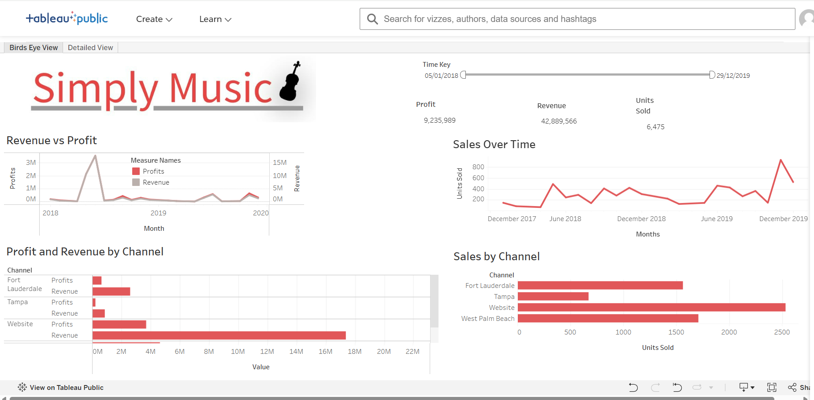
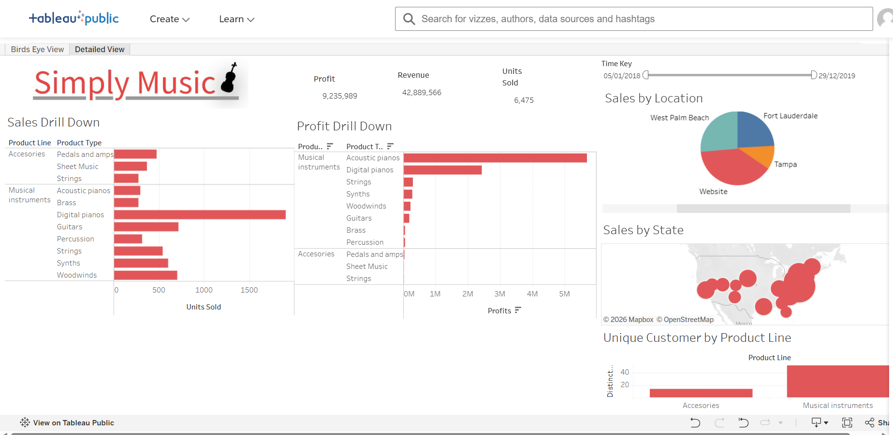

# Simply Music – Sales Performance & Business Intelligence Dashboard

## Tableau Sales & Business Intelligence Analysis

### Bird's Eye View

### Detailed View

### Project Overview

This project provides an interactive business intelligence analysis of Simply Music's sales performance. The dashboard was developed in Tableau to provide a clear view of revenue, profit, units sold, sales trends, product performance and sales channel performance.

The analysis enables users to move from a high-level overview of business performance to more detailed analysis across products, locations and sales channels.

## Business Objective

The project was designed to analyse sales performance and provide decision-makers with actionable business insights in order to:

- Monitor overall revenue, profit and units sold.
- Analyse sales and profit trends over time.
- Compare performance across sales channels.
- Evaluate product and product-line performance.
- Examine sales performance across locations.
- Identify patterns that can support sales and commercial decision-making.

## Key Performance Indicators

The dashboard tracks the following headline KPIs:

- **Revenue:** 42,889,566
- **Profit:** 9,235,989
- **Units Sold:** 6,475

## Dashboard Structure

### Bird's Eye View

The Bird's Eye View provides an executive-level overview of business performance, including:

- Revenue vs Profit
- Sales Over Time
- Profit and Revenue by Channel
- Sales by Channel
- Headline Revenue, Profit and Units Sold KPIs
- Interactive date filtering

### Detailed View

The Detailed View provides deeper analysis of:

- Sales by Product Line and Product Type
- Profit by Product Line and Product Type
- Sales by Location
- Sales by State
- Unique Customers by Product Line

## Key Insights

- The **Website** channel recorded the highest unit sales among the sales channels displayed.
- Product-level analysis shows differences in sales and profitability across the music product portfolio.
- **Digital pianos** recorded the highest unit sales among the product types shown in the detailed analysis.
- **Acoustic pianos** generated the largest profit contribution among the product types displayed.
- Musical instruments attracted more unique customers than accessories.
- Sales performance varied over time, highlighting the importance of monitoring trends alongside overall revenue and profit.

## Business Recommendations

Based on the dashboard analysis:

- Continue monitoring the Website channel as an important contributor to sales volume.
- Use product-level sales and profitability analysis to support inventory and product planning.
- Evaluate high-performing products alongside profitability rather than relying on sales volume alone.
- Monitor sales trends over time to identify periods of stronger and weaker performance.
- Use geographic and customer analysis to support more targeted commercial and marketing decisions.

## Tools & Techniques

- **Tableau**
- Interactive Dashboards
- Calculated Fields
- KPI Scorecards
- Data Visualisation
- Date Filtering
- Sales & Profit Analysis
- Business Intelligence
- Data Storytelling

## Interactive Tableau Dashboard

Explore the full interactive dashboard on Tableau Public:

https://public.tableau.com/app/profile/collins.agyei/viz/SIMPLEMUSICFINAL/BirdsEyeView

## Repository Contents

- `SIMPLE MUSIC FINAL.twbx` – Tableau packaged workbook
- `README.md` – Project documentation

## Author

**Collins Agyei**  
MSc Data Analytics | Data Analyst | Business Intelligence
